# DB user
you need to change mysql db meta info in setting.py if download to local for test
```python
DATABASES = {
    'default': {
        'ENGINE': 'django.db.backends.mysql',
        'NAME': 'LittleLemon',
        'USER': 'root',
        'PASSWORD': 'pwd@1234',
        'HOST': '127.0.0.1',
        'PORT': '3306',
        'OPTIONS': {
            'init_command': "SET sql_mode='STRICT_TRANS_TABLES'"
        }
    }
}
```


# Super user: change to your local username/password
```
username: admin
email: admin@littlelemon.com
password: admin@123
login url: http://127.0.0.1:8000/admin/login/?next=/admin/
```


# Review criteria

**Does the web application use Django to serve static HTML content?**

YES

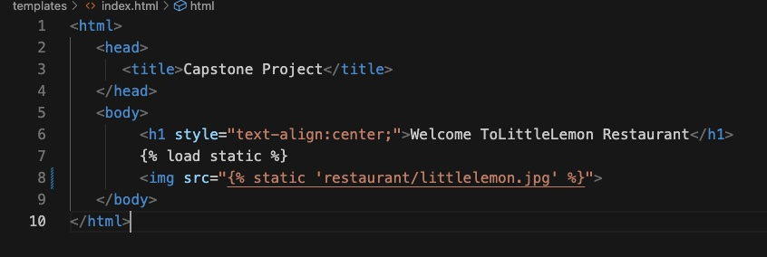
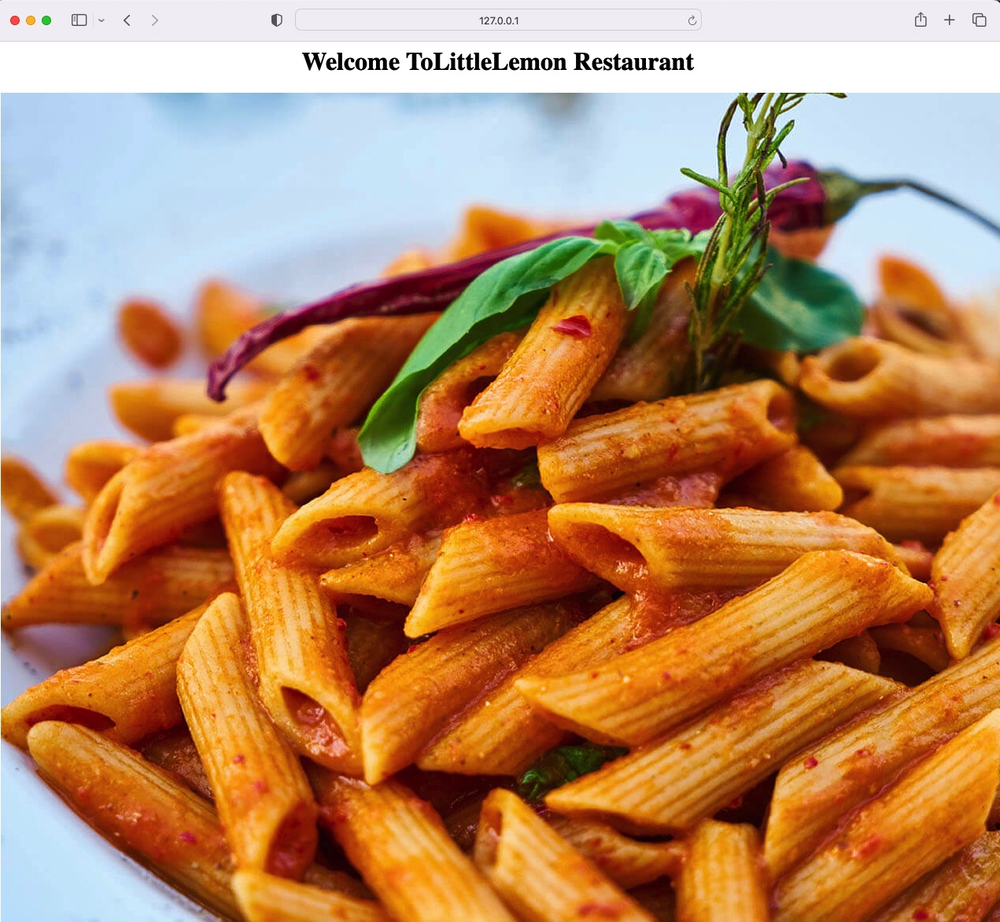


**Has the learner committed the project to a Git repository?**
YES
https://github.com/AlexanderLv/LittleLemon.git
git@github.com:AlexanderLv/LittleLemon.git

**Does the application connect the backend to a MySQL database?**
YES

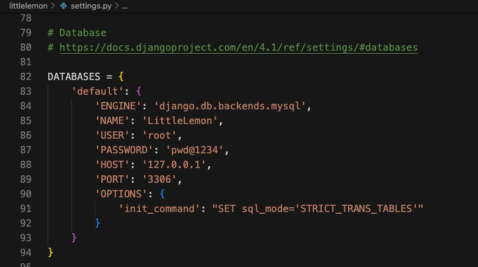

**Are the menu and table booking APIs implemented?**

YES
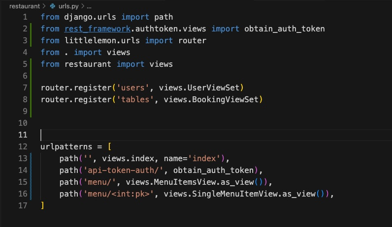
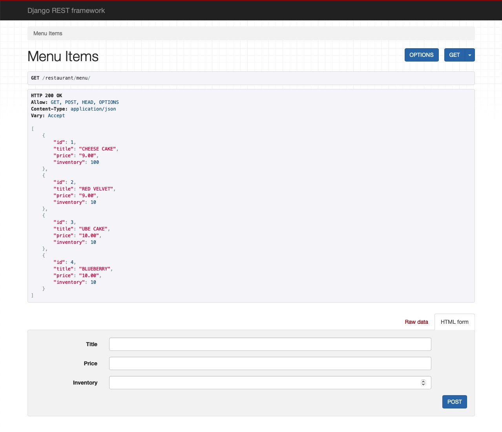
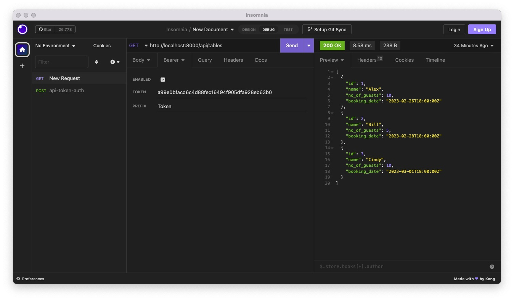

**Is the application set up with user registration and authentication?**

YES
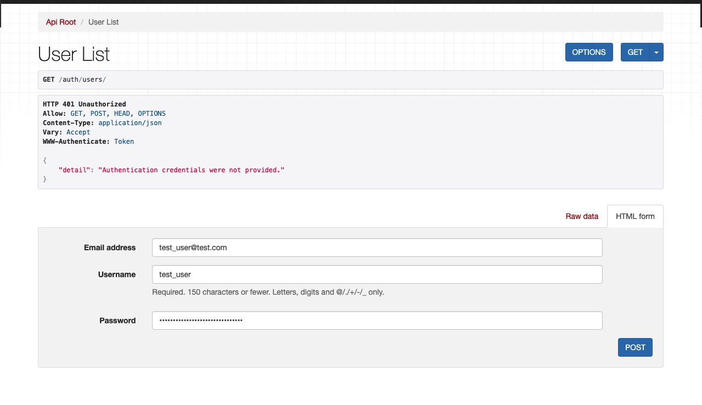
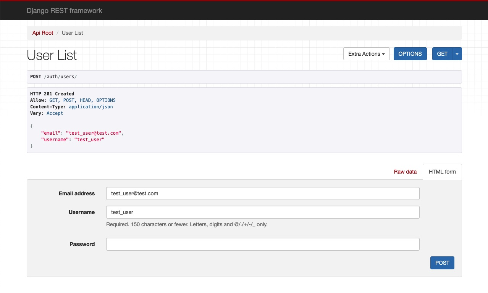
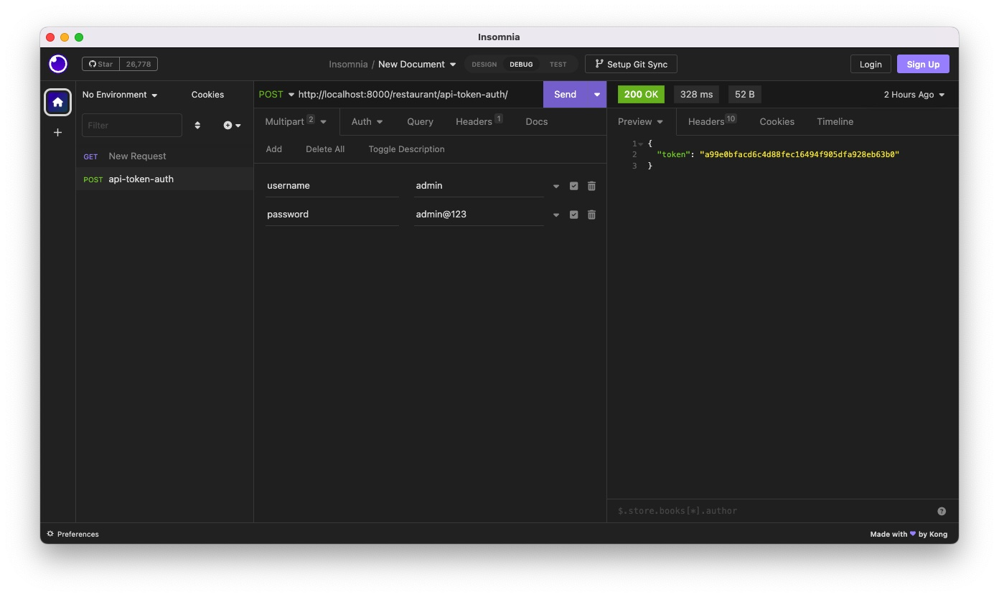

**Does the application contain unit tests?**
YES
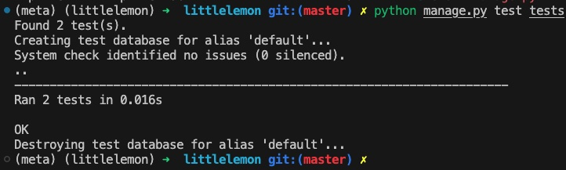
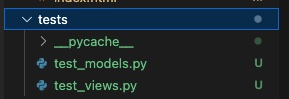

**Can the API be tested with the Insomnia REST client?**

YES, see above


thanks.